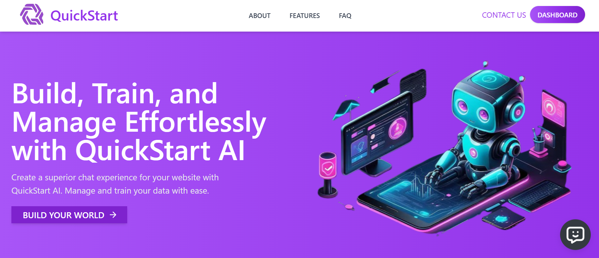
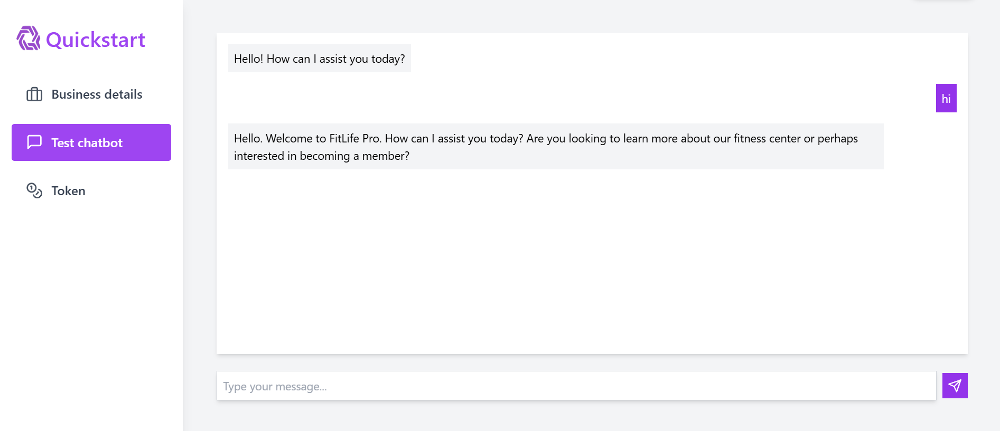
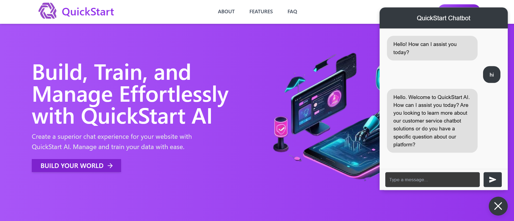
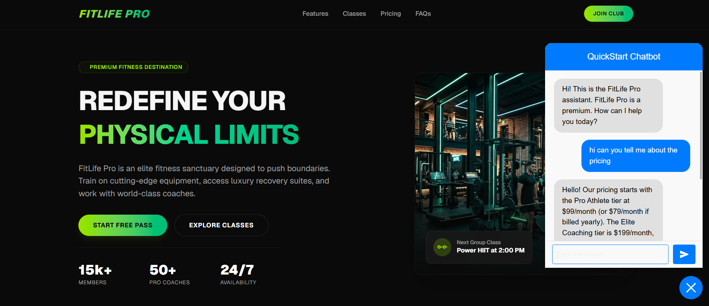

# 🚀 QuickStart AI

[](https://nextjs.org/)
[](https://expressjs.com/)
[](https://www.mongodb.com/)
[](https://groq.com/)

QuickStart AI is a premium, full-stack SaaS platform designed to empower businesses with custom, AI-powered chatbots. It allows businesses to easily train a chatbot on their specific information, test it in an interactive playground, and deploy it to automate customer service.

---

## 📸 Platform Previews & Screenshots

<details>
  <summary>🔍 Click to view previews</summary>

  ### 🏠 Landing Page
  

  ### 📊 Token Management Dashboard
  Track your token usage, limits, and subscription tier in real-time.
  

  ### 🧠 Chatbot Training & FAQ Setup
  Easily train your chatbot by adding custom Business Details and FAQs.
  

  ### 💬 Playground / Testing Chatbot
  Test your trained chatbot directly in the dashboard interactive playground.
  

  ### 🤖 Chatbot Widget Interface
  The elegant customer-facing floating chatbot widget.
  

  ### 🔗 Live Platform Integration
  An example of the chatbot widget seamlessly integrated and tested on another platform (FitLife Pro).
  

</details>

---

## ✨ Features

- **Instant Chatbot Setup**: Set up and train your chatbot in minutes using simple business information (Name, Description, FAQs).
- **Free, High-Performance AI Generation**: Powered by the **Groq API** (`llama-3.3-70b-versatile`), offering high-speed, cost-free completions with robust system instructions.
- **Interactive Training Dashboard**: Train the chatbot with dynamically generated questions or manually inputted custom Q&As.
- **Embedded Chat Widget**: Integrate a floating conversational widget onto external websites.
- **Interactive Playground**: Chatbot playground allowing real-time testing of system prompt behaviors, business detail context, and user input.
- **Token Management**: Integrated Token Tracker panel to manage usage limits.
- **Automated Mail Alerts**: Contact/inquiry form powered by Nodemailer that automatically notifies the project owners.

---

## 🛠️ Tech Stack & Architecture

### Frontend (Next.js App)
- **Framework**: Next.js (App Router)
- **State Management**: Redux Toolkit (with React Redux)
- **Styling**: Tailwind CSS & NextUI
- **Animations**: Framer Motion
- **Icons**: Lucide React & React Icons
- **Interactive Charts**: Recharts

### Backend (Node.js & Express)
- **Server**: Express.js
- **Database**: MongoDB with Mongoose (configured with custom DNS resolution to prevent SRV lookup failures)
- **AI Core**: Groq SDK (Llama 3.3 Llama-70b model)
- **Email System**: Nodemailer (sending notifications to admins)
- **Security & Performance**: Express Rate Limit, Cookie Parser, Compression, Cors, and Morgan logging.

---

## 🔌 Chatbot Widget Integration

To integrate the QuickStart AI chatbot widget onto any React / Next.js website, use the new widget package:

### 1. Install the Widget
```bash
npm install quickstart-ai-chatbot-widget
```

### 2. Import and Use the Widget
```jsx
import React from 'react';
import { ChatBot } from 'quickstart-ai-chatbot-widget';

function App() {
  return (
    <div>
      <ChatBot 
        token="YOUR_BUSINESS_TOKEN" 
        apiUrl="https://your-api-endpoint.com/api/v1" // Your quickstart-ai backend URL
        theme="primary"
        wantToShowSuggestions={true}
      />
    </div>
  );
}

export default App;
```

---

## ⚙️ Installation & Getting Started (Local Development)

### Prerequisites
- Node.js (v18+)
- MongoDB Atlas or local MongoDB instance
- Groq API Key

### Backend Setup
1. Navigate to the Backend folder:
   ```bash
   cd Backend
   ```
2. Install dependencies:
   ```bash
   npm install
   ```
3. Create a configuration file in `Backend/config/.env` and add the following environment variables:
   ```env
   PORT=3000
   DB_URI=your_mongodb_connection_string
   JWT_SECRET=your_jwt_secret
   COOKIE_EXPIRE=10
   JWT_EXPIRE=10d
   CRYPTO_SECRET_KEY=your_crypto_secret
   GROQ_API_KEY=your_groq_api_key
   SMPT_SERVICE=gmail
   SMPT_MAIL=your_email@gmail.com
   SMPT_PASSWORD=your_email_app_password
   ```
4. Start the backend server:
   ```bash
   npm run server
   ```

### Frontend Setup
1. Navigate to the Frontend folder:
   ```bash
   cd ../Frontend
   ```
2. Install dependencies:
   ```bash
   npm install
   ```
3. Start the Next.js development server:
   ```bash
   npm run dev
   ```

### Concurrent Development (Recommended)
You can start both the Backend server and Frontend Next.js app concurrently from the `Backend` directory:
```bash
cd Backend
npm run dev
```